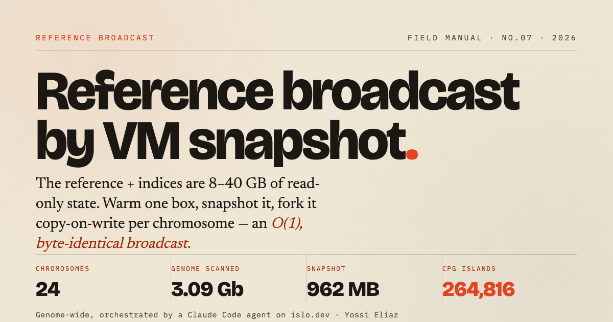

# Reference broadcast by VM snapshot

**Copy-on-write fan-out for genomic scatter-gather — a real, genome-wide, reproducible demo on [islo.dev](https://islo.dev), orchestrated end-to-end by a Claude Code agent.**

🔗 **Live:** https://zozo123.github.io/genomics-sandboxes/



---

Sequencing collapsed to ~$100 a genome ([Ultima UG 100](https://www.statnews.com/2024/01/30/ultima-genomics-dna-sequencing-100-dollars/), 2024; ~$80 in 2025).
Reading DNA isn't the cost anymore — computing on it is, and the expensive part is the
*read-only* state every pipeline shares: the reference FASTA (~3 GB) and its indices (BWA ~5 GB,
STAR 27–30 GB, plus GATK bundles) — 8–40 GB of immutable bytes. Best-practice scatter-gather
workflows ([nf-core](https://pubmed.ncbi.nlm.nih.gov/32055031/), GATK Best Practices) fan a run
across 50–1000 shards and re-localize that identical reference to every one of them.

**The one idea: a VM snapshot is the reference broadcast.** Warm one box (open the reference,
load the indices, page them resident), snapshot the initialized address space, and fork it
copy-on-write per shard — the same mechanism Firecracker and Lambda SnapStart use. The (N+1)th
shard costs a page-table setup, not another multi-GB read, and every fork is byte-identical
because they map the same physical pages.

The fan-out is validated against a **positive control**, not a discovery: per-chromosome
CpG-island density is known to track gene density, so a correct map-reduce *must* return the
gene-dense chromosomes on top (chr19, chr17, chr22) and the gene-poor ones at the bottom (chr4,
chr3, chr13). Genome-wide, it does. Recovering a known gradient from an independently written
kernel is evidence the sharding, compute, and reduce are all wired correctly — exactly the check
you want when the pipeline is model-written.

**The harness is a Claude Code agent.** The whole pipeline — warm → snapshot → fork(24) → reduce
→ teardown — is driven end-to-end by an agent running [`crabbox.sh`](./crabbox.sh) / the islo CLI;
in the run below a Claude Code sub-agent orchestrated the entire 24-way fan-out. No scheduler, no
cluster account. Genome-wide receipts (all 24 GRCh38 chromosomes, ~3.09 Gb): warm base built once
in **88.6 s**, snapshot **962 MB** in **10.3 s**, 24-way fan-out in **~60 s** wall-clock; staging
the reference per worker instead would be ≈13 min serially (**~13× on snapshot reuse**, **862 MB**
of redundant reference transfer avoided). Every number on the site is fetched live from
[`data/receipts.json`](./data/receipts.json).

## What it computes

Per human chromosome (GRCh38), in 1 Mb bins:

- **GC %** and the GC landscape (isochores)
- **CpG observed/expected** ratio
- **CpG-island candidates** — Gardiner-Garden & Frommer (1987): 200 bp window, GC > 50 %, obs/exp > 0.6
- assembly-gap (N) fraction

CpG islands aren't trivia: methylation at CpG sites is the switch behind epigenetic age clocks,
cancer screens (promoter hypermethylation), and cell identity — the same signal consumer
epigenetic tests are built on.

## The pattern

```
warm one box ──▶ snapshot it ──▶ fork per chromosome ──▶ reduce
 (toolchain +     (the read-only   (MAP: each shard       (merge per-shard
  reference +      base, broadcast   restores warm,         JSON → genome-wide
  index, once)     to every worker)  just computes)         landscape, delete boxes)
```

Four verbs of the islo CLI, genome-wide:

```bash
# 1 · warm base: toolchain + all 24 GRCh38 chromosomes + index (paid once)
islo use gx-warm -- bash -lc './warmup.sh chr1 chr2 ... chr22 chrX chrY'

# 2 · broadcast: freeze the warm box to a snapshot
islo snapshot save gx-warm --name genomics-wg

# 3 · MAP: fork one warm box per chromosome (waves of 8)
for chr in chr1 ... chrY; do
  islo use gx-$chr --snapshot genomics-wg -- python3 compute.py $chr &
done; wait

# 4 · REDUCE: merge per-shard JSON, then delete the boxes
```

The whole thing is `./crabbox.sh run`, driven end-to-end by a **Claude Code agent** as the harness.

## Real receipts — genome-wide (this run)

| | |
|---|---|
| Chromosomes (shards) | 24 — chr1–chr22, chrX, chrY |
| Bases scanned | 3,088,269,832 (~3.09 Gb) |
| CpG sites | 29,401,360 |
| CpG-island candidates | 264,816 |
| Warm base built (once) | 88.6 s |
| Snapshot | 962 MB, saved in 10.3 s |
| Warm 24-way fan-out | ~60 s wall-clock (3 waves of 8) |
| Cold-equivalent serial staging | ~13 min |
| Re-run speedup (snapshot reuse) | ~13× |
| Redundant reference downloads avoided | ~862 MB |
| Orchestrator | a Claude Code sub-agent |

Raw numbers behind every figure: [`data/receipts.json`](./data/receipts.json) (the site fetches
it live — nothing is hardcoded). Per-shard outputs are in `data/wg_warm_*.json`.

### The free correctness check

The fan-out recovers a known biological fact, genome-wide: **CpG-island density tracks gene density.**

| chromosome | islands / sequenced Mb | |
|---|---|---|
| chr19 | **287.6** | densest in the genome |
| chr17 | 178.8 | |
| chr22 | 174.0 | gene-rich |
| chr16 | 147.8 | |
| … | … | (24 chromosomes, sorted) |
| chr13 | 68.5 | |
| chr3  | 63.2 | gene-poor |
| chr4  | **62.4** | sparsest |

The gene-dense chromosomes (chr19/17/22) sort to the top and the gene-poor ones (chr4/3/13) to
the bottom — across all 24, from an independently written kernel. If the map-reduce were wrong,
the gradient would be wrong. It isn't.

## Reproduce

```bash
# islo CLI + login required (https://islo.dev)
./crabbox.sh run                   # genome-wide: warm → snapshot → fork(24) → reduce → data/
#   (or the 5-chromosome quick version: bash scripts/run_demo.sh)
python3 -m http.server 8799        # then open http://localhost:8799
```

| File | Purpose |
|------|---------|
| `crabbox.sh` | genome-wide harness (warm → snapshot → 24-way fan-out → reduce); run by a Claude Code agent |
| `index.html` / `styles.css` / `script.js` | the interactive explainer (vanilla, no build, fetches `data/*.json`) |
| `scripts/compute.py` | the MAP kernel — one chromosome → JSON (numpy, memory-frugal) |
| `scripts/reduce_wg.py` | genome-wide reduce → `data/receipts.json` + `data/landscape.json` |
| `scripts/warmup.sh` | the warm-up that gets snapshotted (toolchain + reference + index) |
| `scripts/run_demo.sh` | host orchestrator: warm → snapshot → cold/warm fan-out → reduce |
| `data/` | measured receipts + reduced landscape + raw per-shard outputs |
| `og-card.html` | self-contained 1200×630 social card (rendered to `og.png`) |

## Caveats (read these)

**Not medical advice.** This computes sequence statistics on the *public* human reference. It is
not a clinical test, not a diagnosis, and says nothing about any individual. CpG-island counts
are candidate calls (Gardiner-Garden & Frommer 1987; Takai & Jones 2002 tightened the rule), not
curated annotations like ENCODE's cCRE Registry (Moore et al., *Nature* 2020).

The snapshot/fork-for-startup mechanism is **standard systems infrastructure** (CRIU, Firecracker
COW restore, AWS Lambda SnapStart) — pointed here at a heavy, read-only genomics reference
fan-out. Nothing about the mechanism is claimed as new. At this toy scale the first-run speedup
is modest; the real payoff is **amortization** (re-runs pay only the map wall-clock) and
**byte-identical reproducibility** across shards. Scale to a 3 GB reference + BWA indices across a
cohort and the snapshot becomes the only sane way to do it.

## Related

- [The Sandbox Shift](https://zozo123.github.io/sandboxes-why-how-when/)
- [The Living Layer](https://zozo123.github.io/the-living-layer/)
- [Databases in the AI Era](https://zozo123.github.io/databases-in-the-ai-era/)

Ideas owed to Dean & Ghemawat (MapReduce, 2004) and the ENCODE Consortium. Reference: GRCh38
(UCSC goldenPath). By [Yossi Eliaz](https://www.linkedin.com/in/yossi-eliaz), 2026.
